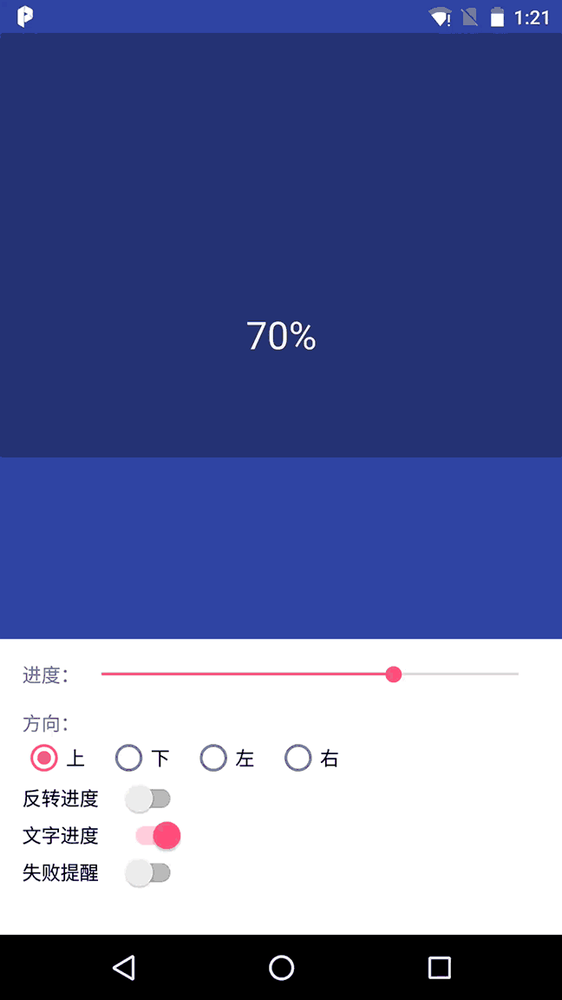

## 说明：
适用于图片上传下载或 app 安装等场景的遮罩层进度控件，
支持指定上下左右4个方向和失败提醒配置。



## 使用：

### 1. 添加 jpack 仓库

项目根目录下 builde.gradle 添加 jpack 仓库，如下：

``` gradle
	allprojects {
		repositories {
			...
			maven { url 'https://jitpack.io' }
		}
	}
```

### 2. 依赖

```gradle
dependencies {
		compile 'com.github.thearyong:ProgressLayerView:v1.0.0'
	}
```

### 3. xml
``` xml
  <com.thearyong.plv.ProgressLayerView
        android:id="@+id/pv"
        android:layout_width="match_parent"
        android:layout_height="0dp"
        android:layout_gravity="center_horizontal"
        android:layout_weight="1"
        android:background="@color/colorPrimaryDark"
        app:pv_direction="UP"
        app:pv_layer_color="#55111111"
        app:pv_progress="30"
        app:pv_text_color="#f1f1f1"
        app:pv_text_able="true"
        app:pv_text_size="28sp"/>

```
### 4. java

``` java
    ProgressLayerView pv = (ProgressLayerView) findViewById(R.id.pv);
    pv.setDirect(ProgressView.DIRECT.UP).setProgress(50);

```
